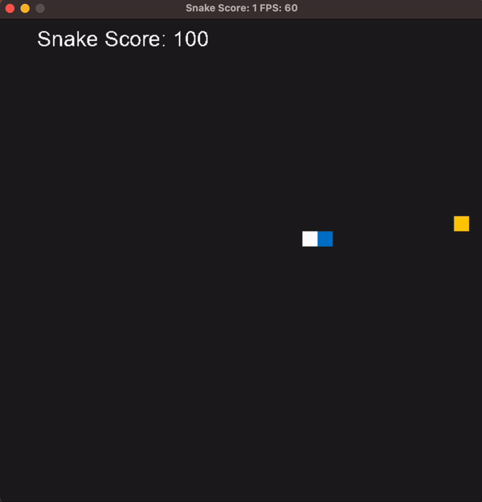

# CPPND: Capstone Snake Game Example

This is a starter repo for the Capstone project in the [Udacity C++ Nanodegree Program](https://www.udacity.com/course/c-plus-plus-nanodegree--nd213). The code for this repo was inspired by [this](https://codereview.stackexchange.com/questions/212296/snake-game-in-c-with-sdl) excellent StackOverflow post and set of responses.

The Capstone Project gives you a chance to integrate what you've learned throughout this program. This project will become an important part of your portfolio to share with current and future colleagues and employers.

In this project, you can build your own C++ application or extend this Snake game, following the principles you have learned throughout this Nanodegree Program. This project will demonstrate that you can independently create applications using a wide range of C++ features.

## Dependencies for Running Locally
* cmake >= 3.7
  * All OSes: [click here for installation instructions](https://cmake.org/install/)
* make >= 4.1 (Linux, Mac), 3.81 (Windows)
  * Linux: make is installed by default on most Linux distros
  * Mac: [install Xcode command line tools to get make](https://developer.apple.com/xcode/features/)
  * Windows: [Click here for installation instructions](http://gnuwin32.sourceforge.net/packages/make.htm)
* SDL2 >= 2.0
  * All installation instructions can be found [here](https://wiki.libsdl.org/Installation)
  >Note that for Linux, an `apt` or `apt-get` installation is preferred to building from source. 
* gcc/g++ >= 5.4
  * Linux: gcc / g++ is installed by default on most Linux distros
  * Mac: same deal as make - [install Xcode command line tools](https://developer.apple.com/xcode/features/)
  * Windows: recommend using [MinGW](http://www.mingw.org/)

## Requirements

MacOS with arm64 architecture

## Basic Build Instructions

1. Clone this repo.
2. Make a build directory in the top level directory: `mkdir build && cd build`
3. Compile: `cmake .. && make`
4. Run it: `./SnakeGame`.

## Feature

### Feature 1 : Score Display in UI
#### Overview
The update introduces a new feature that displays the player's score directly in the user interface (UI) during gameplay. This addition enhances the user experience by providing immediate feedback on the player's progress and performance.

#### Implementation Details
* ***Dependency:*** The feature utilizes the `SDL2_ttf` library to implement text rendering in the UI.
* ***Font Asset:*** To display the score, the game requires loading the font asset `arial.ttf`.
* ***Scoring Logic:*** Every time the player's snake consumes food, 100 points are added to the player's score.

### Feature 2: Random Update Snake's Food Position
#### Overview
In this update, I have introduced a feature that periodically updates the position of the snake's food. This addition enhances gameplay by introducing an element of unpredictability, requiring players to adapt to changing conditions and strategize accordingly.

#### Implementation Details
* ***SnakeFood Class:*** A new `SnakeFood` class has been added to handle the generation and management of snake food position.
* ***Random Position Update:*** The position of the snake's food will be randomly updated every 5 seconds if the player fails to consume the food within that time frame.
* ***MessageQueue Integration:*** The implementation utilizes a MessageQueue to process and communicate the updated food positions. The `SnakeFood` class adds new positions to the message queue, and the `game.cpp` receives and processes these positions accordingly.

## Success Criteria

### Loops, Functions, I/O

1. The project demonstrates an understanding of C++ functions and control structures. (`render.cpp`)
2. The project reads data from a file and process the data, or the program writes data to a file. (`render.cpp`)

### Object Oriented Programming

1. One or more classes are added to the project with appropriate access specifiers for class members. (`SnakeFood.h`)
2. Class constructors utilize member initialization lists. (`SnakeFood.cpp`)
3. Templates generalize functions or classes in the project. (`SnakeFood.h`)

### Memory Management

1. The project makes use of references in function declarations. (`renderer.h`)
2. The project uses destructors appropriately. (`renderer.cpp`)
3. The project uses scope / Resource Acquisition Is Initialization (RAII) where appropriate. (`SnakeFood.cpp`)
4. The project uses move semantics to move data instead of copying it, where possible. (`SnakeFood.cpp`)

### Concurrency

1. The project uses multithreading. (`game.cpp`)
2. A mutex or lock is used in the project. (`SnakeFood.cpp`)
3. A condition variable is used in the project. (`SnakeFood.cpp`)

## CC Attribution-ShareAlike 4.0 International

Shield: [![CC BY-SA 4.0][cc-by-sa-shield]][cc-by-sa]

This work is licensed under a
[Creative Commons Attribution-ShareAlike 4.0 International License][cc-by-sa].

[![CC BY-SA 4.0][cc-by-sa-image]][cc-by-sa]

[cc-by-sa]: http://creativecommons.org/licenses/by-sa/4.0/
[cc-by-sa-image]: https://licensebuttons.net/l/by-sa/4.0/88x31.png
[cc-by-sa-shield]: https://img.shields.io/badge/License-CC%20BY--SA%204.0-lightgrey.svg
